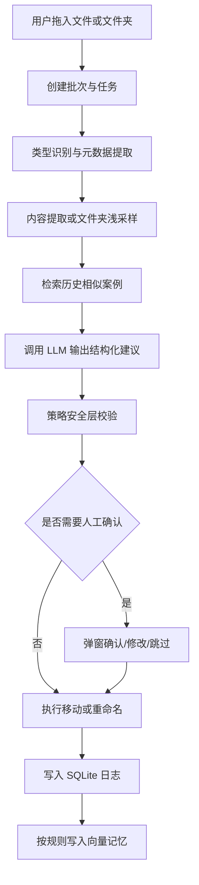

# AI 文件整理工具开发计划

## 1. 文档目标

本文档用于定义 AI 文件整理工具的 MVP 边界、系统架构、数据设计、核心流程、开发里程碑与验收标准。

本文档作为阶段性总纲保留。具体实现约束以 `dev_docs/00_readme.md` 引导的文档体系为准，其中产品契约、数据模型、接口契约、UI 规范和交付规则分别在对应文档中维护。

目标不是一次性覆盖所有文件格式，而是先做出一个安全、可回滚、可扩展、用户愿意信任的整理工具。

## 2. 产品目标与非目标

### 2.1 产品目标

1. 接收用户拖入的文件或文件夹。
2. 自动提取元数据与有限内容线索，生成分类建议。
3. 在受控分类树内完成移动或重命名。
4. 对低置信度或高风险操作触发人工确认。
5. 保留完整操作记录，支持撤销。
6. 基于历史确认结果持续提升后续分类质量。

### 2.2 MVP 非目标

1. 不在第一阶段支持所有文档格式的深度解析。
2. 不自动覆盖已存在文件。
3. 不允许 AI 直接生成任意物理路径并绕过本地规则。
4. 不对未显式拖入的全盘文件执行扫描式整理。
5. 不在 MVP 阶段引入复杂权限管理、多用户协同或云同步。

## 3. MVP 范围

### 3.1 第一阶段支持对象

1. 文件夹
2. 纯文本文件
3. PDF
4. 常见图片文件
5. 其他无法可靠解析的文件进入“未分类/待确认”

### 3.2 第一阶段关键能力

1. 拖拽导入
2. 批次队列处理
3. 元数据提取
4. 浅层内容提取
5. AI 分类建议
6. 路径安全校验
7. 文件移动与重命名
8. 冲突处理
9. 操作日志
10. 撤销
11. 人工确认弹窗

## 4. 总体架构

建议采用 6 层架构，而不是直接由 AI 决定最终路径。

1. UI 层
2. 输入编排层
3. 解析层
4. 策略安全层
5. AI 决策层
6. 执行与审计层

### 4.1 架构说明

#### UI 层

负责拖拽导入、状态展示、人工确认、设置管理、历史记录与撤销入口。

#### 输入编排层

负责将拖入内容转成任务批次，进行排队、限流、暂停、取消、重试。

#### 解析层

负责类型识别、元数据提取、内容截取、文件夹浅采样、特征标准化。

#### 策略安全层

负责分类树约束、白名单路径校验、非法字符清洗、冲突策略、人工复核门槛。

#### AI 决策层

负责构建 Prompt、检索历史案例、调用模型，输出结构化建议。

#### 执行与审计层

负责物理移动、重命名、事务日志、撤销、SQLite 记录与向量记忆写入。

## 5. 模块职责设计

### 5.1 UI 层

#### 拖拽响应区

职责：
1. 接收用户拖入的文件或文件夹路径
2. 展示即将处理的批次数量
3. 允许用户开始或取消当前批次

#### 状态反馈面板

职责：
1. 展示批次状态
2. 展示每个任务的处理阶段
3. 展示成功、失败、待确认、已跳过数量
4. 提供历史记录查询和撤销入口

状态建议：
1. `queued`
2. `sniffing`
3. `parsing`
4. `retrieving_context`
5. `calling_model`
6. `awaiting_review`
7. `executing`
8. `completed`
9. `failed`
10. `rolled_back`

#### 人工确认弹窗

触发条件：
1. 模型返回低置信度
2. 模型建议重命名但名称质量不高
3. 文件类型不明确
4. 目标路径不合法或不在分类树中
5. 出现重名冲突

操作选项：
1. 确认分类
2. 修改名称
3. 改投未分类
4. 跳过本次任务

#### 设置中心

配置项：
1. 目标根目录
2. 备份或暂存目录
3. 自定义分类树
4. 未分类目录
5. 是否启用 RAG
6. LLM 提供方与模型参数
7. 冲突策略
8. 低置信度阈值

### 5.2 输入编排层

#### 类型嗅探器

职责：
1. 判断文件或文件夹
2. 基于扩展名、MIME、魔数做类型识别
3. 识别符号链接、快捷方式、隐藏文件等特殊对象

#### 任务路由器

职责：
1. 文件夹走浅采样流程
2. 文件走解析流程
3. 不支持类型直接打上待确认标签

#### 有界并发任务队列

原则：
1. 避免 UI 卡死
2. 支持小规模并发，而不是完全串行
3. AI 调用并发需要单独限流

建议并发配置：
1. 解析并发：2 到 4
2. 检索并发：1 到 2
3. 模型调用并发：1 到 2

### 5.3 解析层

#### 元数据提取器

提取字段：
1. 原始路径
2. 文件名
3. 扩展名
4. 大小
5. 创建时间
6. 修改时间
7. 父目录

#### 内容提取器

策略：
1. 纯文本读取前若干字节并尝试编码识别
2. PDF 提取标题、前几段文本
3. 图片优先提取文件名和元数据，OCR 放到后续迭代
4. 不可解析文件仅保留元数据特征

#### 文件夹浅采样器

最少采样内容：
1. 文件夹名
2. 前 N 个子项名
3. 子项类型分布
4. 总文件数和总目录数

说明：
文件夹禁止只凭顶层名称直接归档。

#### 特征标准化器

职责：
1. 清理乱码
2. 标准化日期与大小单位
3. 统一特征结构供检索与模型调用

### 5.4 策略安全层

这是核心防线，不能省略。

职责：
1. 校验目标分类是否存在
2. 限制路径只能落在目标根目录下
3. 限制目录层级深度
4. 清理非法文件名字符
5. 判断是否需要人工确认
6. 决定冲突处理策略

关键原则：
1. AI 只提供建议，不直接控制文件系统路径
2. 最终物理路径必须由本地规则层拼装
3. 默认禁止覆盖已有文件

### 5.5 AI 决策层

#### Prompt Builder

输入：
1. 文件基础元数据
2. 内容片段或文件夹浅采样结果
3. 分类树定义
4. 历史相似案例

输出格式要求：
1. `category_id`
2. `suggested_name`
3. `confidence`
4. `reason`
5. `need_human_review`

禁止输出：
1. 任意绝对路径
2. 未在分类树中的新分类

#### Context Retriever

职责：
1. 从历史确认案例中检索相似样本
2. 为当前任务注入少量参考示例

检索数据源：
1. 仅使用人工确认成功的样本
2. 或高置信度且未撤销的自动样本

#### LLM Client

设计要求：
1. 支持本地模型和云端模型抽象
2. 支持 JSON 解析与重试
3. 支持超时、回退与失败分类

### 5.6 执行与审计层

#### 文件系统执行器

职责：
1. 创建目标目录
2. 执行移动
3. 执行重命名
4. 写入执行结果

#### 冲突处理器

默认策略：
1. 禁止覆盖
2. 自动添加序号后缀，如 `(1)`、`(2)`
3. 高价值文件可要求人工处理

#### 操作日志数据库

职责：
1. 记录每次移动或重命名
2. 支持回滚
3. 保留审计轨迹

#### 向量记忆库

写入门槛：
1. 人工确认后的结果
2. 高置信度且后续未被撤销的结果

## 6. 核心数据结构

### 6.1 AI 输入特征建议结构

```json
{
  "source_path": "string",
  "item_type": "file|folder",
  "name": "string",
  "extension": "string|null",
  "mime_type": "string|null",
  "size_bytes": 0,
  "created_at": "ISO-8601",
  "modified_at": "ISO-8601",
  "content_excerpt": "string|null",
  "folder_sample": {
    "child_names": [],
    "type_summary": {}
  }
}
```

### 6.2 AI 输出建议结构

```json
{
  "category_id": "finance/invoice",
  "suggested_name": "2026-03 供应商发票.pdf",
  "confidence": 0.92,
  "reason": "文件名与内容均指向发票场景",
  "need_human_review": false
}
```

### 6.3 SQLite 表设计建议

#### `batches`

字段：
1. `id`
2. `created_at`
3. `status`
4. `source_count`

#### `tasks`

字段：
1. `id`
2. `batch_id`
3. `source_path`
4. `item_type`
5. `status`
6. `error_message`
7. `created_at`
8. `updated_at`

#### `operations`

字段：
1. `id`
2. `task_id`
3. `operation_type`
4. `source_path`
5. `target_path`
6. `final_name`
7. `file_size`
8. `modified_at`
9. `content_hash_optional`
10. `result`
11. `created_at`

#### `reviews`

字段：
1. `id`
2. `task_id`
3. `review_type`
4. `user_decision`
5. `review_payload`
6. `created_at`

#### `category_tree`

字段：
1. `id`
2. `parent_id`
3. `display_name`
4. `path_segment`
5. `is_enabled`

### 6.4 向量库元数据建议

字段：
1. `task_id`
2. `item_type`
3. `feature_text`
4. `final_category_id`
5. `final_name`
6. `confirmed_by_user`
7. `was_rolled_back`
8. `created_at`

## 7. 核心流程

### 7.1 自动整理流程



### 7.2 撤销流程

1. 用户从历史记录选择一次操作
2. 系统校验目标文件是否仍存在且未被外部修改
3. 根据日志执行逆向移动或逆向重命名
4. 将该记录标记为已回滚
5. 相关向量样本标记为不可用于未来训练参考

## 8. 关键设计决策

### 8.1 不让模型直接输出物理路径

原因：
1. 防止模型越界写入
2. 防止生成不存在的目录结构
3. 便于以后替换分类树或路径规则

### 8.2 文件夹必须做浅采样

原因：
1. 文件夹名称常常信息不足
2. 仅凭名称整理整个文件夹风险过高

### 8.3 默认不覆盖已有文件

原因：
1. 文件整理最严重的风险是数据丢失
2. 自动覆盖难以建立用户信任

### 8.4 向量样本必须带质量门槛

原因：
1. 错误样本会放大错误
2. 人工确认样本比纯自动样本更可靠

### 8.5 先做 Preview，再强调全自动

原因：
1. 用户需要先看到建议结果
2. 早期模型效果波动较大

## 9. 技术实现建议

## 9.1 技术栈约束

当前项目技术栈已固定为：

1. 桌面主应用：Tauri
2. 前端界面：React + TypeScript
3. 桌面能力与编排层：Rust
4. AI 与解析侧车：Python
5. 本地数据库：SQLite
6. 向量库：ChromaDB
7. 模型提供方：硅基流动云 API
8. 首发平台：Windows

关键约束：

1. 不使用本地 Ollama 作为首版模型方案。
2. 搜索范围仅限已纳入本工具管理的文件。
3. 设置中心第一版为普通设置页，不引入插件系统和多人权限。
4. 重大变更必须先更新 `dev_docs` 文档体系，再进入实现。

### 9.2 目录结构建议

```text
project/
  app/
    ui/
    orchestrator/
    parsers/
    policy/
    ai/
    executor/
    storage/
  tests/
  dev_docs/
```

## 10. 开发里程碑

### M1：项目骨架与基础配置

目标：
1. 初始化工程结构
2. 打通设置中心
3. 定义分类树配置
4. 建立 SQLite 基础表

验收标准：
1. 能保存和读取基础配置
2. 能创建和查询批次、任务、操作记录

### M2：输入编排与基础解析

目标：
1. 实现拖拽导入
2. 实现批次队列
3. 实现文件/文件夹识别
4. 实现元数据提取与文件夹浅采样

验收标准：
1. 拖入 100 个对象时 UI 不冻结
2. 任务状态可见
3. 可输出标准化特征结构

### M3：AI 决策链路

目标：
1. 接入 Prompt Builder
2. 接入 LLM Client
3. 接入 JSON 输出校验
4. 接入本地分类树约束

验收标准：
1. 给定测试样本能返回结构化建议
2. 非法分类能被本地规则拦截

### M4：执行、冲突与撤销

目标：
1. 实现移动与重命名
2. 实现冲突处理
3. 实现日志记录
4. 实现单次操作撤销

验收标准：
1. 可完成真实文件移动
2. 不发生静默覆盖
3. 撤销后文件可回到原位置

### M5：人工确认与预览模式

目标：
1. 接入人工确认弹窗
2. 支持低置信度拦截
3. 支持“预览后执行”

验收标准：
1. 高风险任务不会直接落盘
2. 用户可修改建议名称和分类

### M6：RAG 与记忆闭环

目标：
1. 接入向量检索
2. 写入高质量历史样本
3. 提升同类文件分类一致性

验收标准：
1. 相似任务可检索到历史案例
2. 已撤销样本不会继续参与检索

## 11. 测试计划

### 11.1 单元测试

覆盖：
1. 类型识别
2. 元数据提取
3. 路径拼装
4. 冲突命名
5. JSON 输出校验
6. 回滚逻辑

### 11.2 集成测试

覆盖：
1. 从拖拽到移动的完整链路
2. 低置信度触发人工确认
3. 重名冲突处理
4. 失败中断后的恢复

### 11.3 回归测试样本集

建议建立固定样本库：
1. 财务类文件
2. 工作类文件
3. 生活类文件
4. 无后缀文件
5. 二进制伪装文本文件
6. 混合内容文件夹

## 12. 风险与缓解措施

### 风险 1：模型误分类导致错误移动

缓解：
1. 预览模式
2. 低置信度人工确认
3. 限制只能落到分类树内

### 风险 2：错误样本污染向量库

缓解：
1. 仅写入高质量样本
2. 回滚样本自动失效

### 风险 3：文件覆盖或撤销失败

缓解：
1. 默认禁止覆盖
2. 操作前记录关键文件信息
3. 撤销时做存在性与一致性校验

### 风险 4：解析能力不足导致 AI 信息不全

缓解：
1. 清晰限定 MVP 支持类型
2. 不支持类型进入待确认

## 13. 验收标准

上线 MVP 前至少满足以下条件：

1. 能稳定处理文件和文件夹混合拖入
2. 不会因批量导入导致界面卡死
3. 不会静默覆盖已有文件
4. 模型输出不能绕过本地路径规则
5. 高风险任务会进入人工确认
6. 已执行操作可在受控条件下撤销
7. 历史样本写入具备质量门槛

## 14. 下一步实施建议

建议按以下顺序进入开发：

1. 先实现本地规则与执行闭环，再接 AI
2. 先做 Preview 与撤销，再做全自动批处理
3. 先做文本、PDF、图片和文件夹浅采样，再扩展更多解析器
4. 先让 RAG 读取人工确认样本，再逐步放开高置信度自动样本
